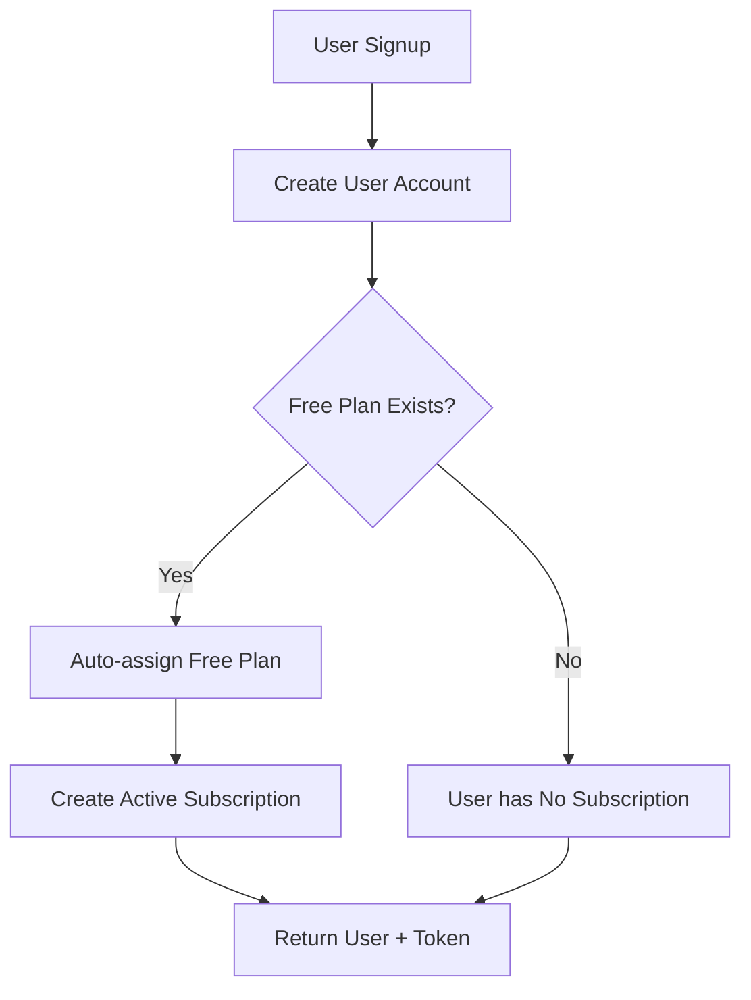

# Free Plan Auto-Assignment on Signup

## Overview

When a new user signs up, the system automatically assigns them a free subscription plan if one exists in the database. This ensures all users start with basic access to the platform without requiring payment.

## Implementation Details

### 1. Free Plan Detection

The system looks for a plan with:
- `price: 0`
- `isActive: true`

If multiple free plans exist, it prefers:
1. Plans marked as `isDefault: true`
2. Plans with lower `sortOrder`

### 2. Signup Flow



### 3. Code Changes

#### Auth Service (`/src/auth/auth.service.ts`)
- Added `PlanService` and `SubscriptionService` dependencies
- Modified `signup` method to:
  1. Create user account
  2. Check for free plan
  3. Automatically create subscription if free plan exists
  4. Log warnings if no free plan is found

#### Plan Service (`/src/BrandBanda/plan/service.ts`)
- Added `getFreePlan()` method to find active free plans

#### Auth Module (`/src/auth/auth.module.ts`)
- Added imports for `PlanModule` and `SubscriptionModule`

## Setting Up a Free Plan

### Option 1: Using the Seed Script

Run the provided seed script to create a default free plan:

```bash
# Install dependencies if needed
npm install

# Run the seed script
npx ts-node scripts/seed-free-plan.ts
```

This creates a free plan with:
- Name: "Free Plan"
- Price: $0
- Features:
  - 1 Project
  - 10 Brand Messages
  - Community Support
  - 7 days analytics retention

### Option 2: Using the Admin API

Create a free plan via the plan management API:

```bash
curl -X POST http://localhost:3041/api/en/plan \
  -H "Authorization: Bearer YOUR_ADMIN_TOKEN" \
  -H "Content-Type: application/json" \
  -d '{
    "name": "Free Tier",
    "description": "Start for free",
    "price": 0,
    "currency": "USD",
    "billingCycle": "monthly",
    "isActive": true,
    "maxProjects": 1,
      "maxBrandMessages": 10,
    "features": {
      "supportLevel": "community"
    }
  }'
```

### Option 3: Direct Database Insert

Insert directly into MongoDB:

```javascript
db.plans.insertOne({
  name: "Free Plan",
  price: 0,
  currency: "USD",
  billingCycle: "monthly",
  isActive: true,
  features: {
    maxProjects: 1,
    maxBrandMessages: 10,
    supportLevel: "community"
  },
  createdAt: new Date(),
  updatedAt: new Date()
});
```

## Behavior Details

### Success Case
- User signs up successfully
- Free plan is found and assigned
- User immediately has access to free tier features
- Logs: "Successfully created free subscription {id} for user {email}"

### No Free Plan Case
- User signs up successfully
- No free plan exists in the system
- User account is created without subscription
- Warning logged: "No free plan found in the system. User will not have a subscription."
- User must manually select and purchase a plan

### Error Handling
- Free plan assignment failures don't block signup
- Errors are logged but signup continues
- User can still access the system and select a plan later

## Testing

### 1. Test with Free Plan
```bash
# Create free plan first
npx ts-node scripts/seed-free-plan.ts

# Sign up new user
curl -X POST http://localhost:3041/api/en/auth/signup \
  -H "Content-Type: application/json" \
  -d '{
    "email": "newuser@example.com",
    "password": "password123",
    "firstName": "Test",
    "lastName": "User"
  }'

# Check user's subscription
curl http://localhost:3041/api/en/subscription/current \
  -H "Authorization: Bearer USER_TOKEN"
```

### 2. Test without Free Plan
```bash
# Remove all free plans from database
# Then signup and verify no subscription is created
```

## Considerations

### 1. Multiple Free Plans
If multiple free plans exist, the system will select based on:
- `isDefault` flag (preferred)
- `sortOrder` (ascending)
- First match

### 2. Plan Changes
- Users on free plans can upgrade anytime
- Free plan features can be modified without affecting existing subscriptions
- Changes to free plan limits apply on next renewal

### 3. Migration
For existing users without subscriptions:
- Run a migration script to assign free plans
- Or let users select plans when they next login

## FAQ

**Q: What happens if the free plan is deactivated?**
A: New signups won't get auto-assigned subscriptions. Existing free subscriptions continue until expired.

**Q: Can users have multiple free subscriptions?**
A: No, the system prevents multiple active subscriptions per user.

**Q: What if signup fails after subscription creation?**
A: The subscription creation is wrapped in try-catch. If user creation succeeds but subscription fails, the user still gets created.

**Q: How to disable auto-assignment?**
A: Simply deactivate all free plans or remove them from the database.